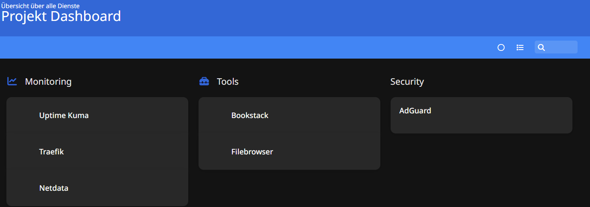
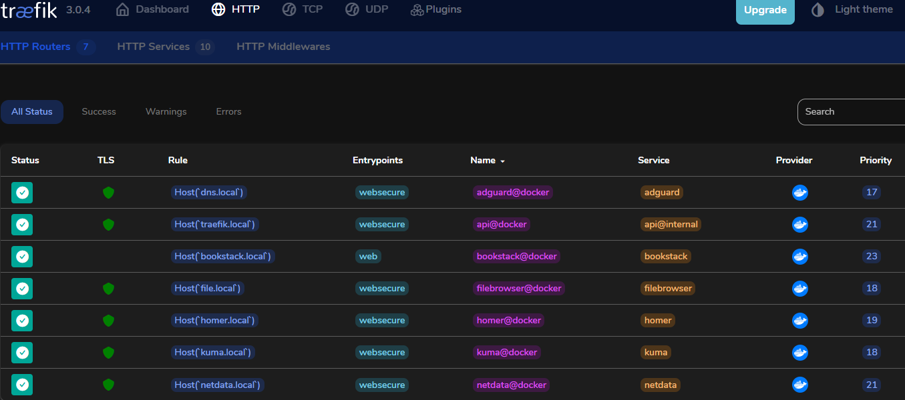

# Selfhosted Cloud Projekt (PLA-2 Abschlussarbeit 2025)

## Projektbeschreibung
Ziel dieses Projekts war es, auf einem Raspberry Pi eine vollständig selfhosted Cloud-Infrastruktur mit Webinterface, Reverse Proxy und Sicherheitsfunktionen zu Erstellen.

## Verwendete Technologien
- **Docker + Docker Compose**
- **Traefik v3.0 (als Reverse Proxy mit TLS)**
- **AdGuard Home (DNS-Filterung + DHCP)**
- **Fail2Ban (SSH Schutz mit Ban-Mechanismus)**
- **Netdata, Homer, Uptime Kuma, Filebrowser, Bookstack**

## Dienste
| Dienst         | Domain                 | Beschreibung                    |
|----------------|------------------------|----------------------------------|
| Traefik        | `https://traefik.local`   | Dashboard für den Reverse Proxy |
| Filebrowser    | `https://file.local`      | Web-Dateimanager                |
| Uptime Kuma    | `https://kuma.local`      | Monitoring Tool                 |
| Homer          | `https://homer.local`     | Dashboard / Bookmarkseite       |
| Netdata        | `https://netdata.local`   | System Monitoring               |
| AdGuard Home   | `https://dns.local`       | DNS & DHCP Verwaltung           |
| Bookstack      | `https://bookstack.local` | Wissensdatenbank (mit DB)       |

### Übersicht über alle Dienste (Homer Dashboard)


## Projektstruktur (Auszug)

/home/piCloudcore/cloudcore-project  
├── adguard  
│   ├── conf  
│   │   └── AdGuardHome.yaml  
│   ├── docker-compose.yml  
│   └── work  
│       └── data 
├── bookstack  
│   ├── docker-compose.yml  
│   └── docker-compose.yml.save  
├── dashy  
├── filebrowser  
│   ├── config  
│   │   └── filebrowser.db  
│   ├── data  
│   │   └── Test  
│   │       └── testfile.md  
│   └── docker-compose.yml  
├── homer  
│   ├── assets  
│   │   ├── config.yml  
│   │   └── icons  
│   │       ├── bookstack.png  
│   │       ├── filebrowser.png  
│   │       ├── netdata.png  
│   │       ├── traefik.png  
│   │       └── uptime-kuma.png  
│   ├── docker-compose.yml  
│   └── homer  
│       └── assets  
├── netdata  
│   └── docker-compose.yml  
├── restic  
├── reverse-proxy  
│   ├── docker-compose.yml  
│   ├── nginx  
│   │   └── default.conf  
│   └── traefik  
│       ├── certs  
│       │   ├── dynamic.yaml  
│       │   ├── self.crt  
│       │   └── self.key  
│       └── docker-compose.yml  
├── scripts  
│   └── backup_containers.sh  
├── start_script.sh  
├── stop_script.sh  
└── uptime-kuma  
    └── docker-compose.yml

## Sicherheit
- SSH gehärtet (kein Passwort-Login, Port 2121, nur via Public Key)
- Fail2Ban aktiv gegen Brute-Force
- HTTPS über eigenes TLS-Zertifikat
- Zugriff auf Dienste nur intern via Traefik

### Traefik Dashboard mit TLS


## Starten & Stoppen aller Container
```bash
./start_script.sh    # Startet alle Container
./stop_script.sh     # Stoppt alle Containerd